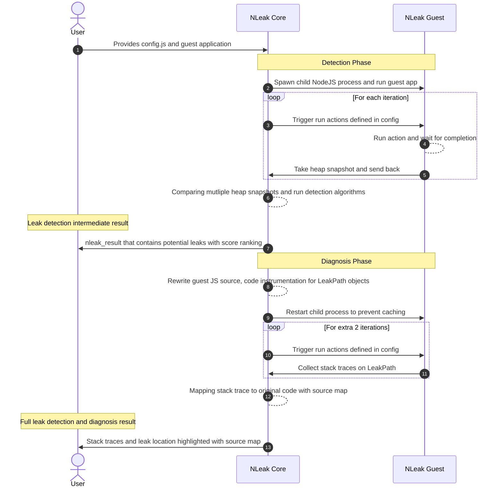

# nleak

[](https://github.com/nleak/n-leak/actions/workflows/n-leak.js.yml)

> **Warning**
> NLeak is currently under development and is not ready for production use.

NLeak is an automatical memory detection and diagnosis tool for NodeJS. It is built on top of BLeak [1], a memory leak detection tool for JavaScript applications. NLeak is designed to be a lightweight and extensible tool that can be easily integrated into existing CI/CD pipelines. NLeak is currently under development and is not ready for production use.

## Background

Memory leaks are a common cause of system memory exhaustion, which can result in slow performance or system crashes. Identifying and fixing memory leaks in JavaScript can be particularly challenging, as the language is dynamically typed and leaks may differ from those in other languages such as C, C++, and Java. There are currently no automated tools that can effectively detect memory leaks in JavaScript applications executed in the NodeJS runtime environment. The team is working on extending BLeak to NodeJS in order to create a memory detection tool that can automate the process of locating, diagnosing, and ranking JavaScript memory leaks in Node.js applications.

## How to use it?

You can simply install NLeak globally and run it on your NodeJS application.

```
npm install -g nleak
```

Then, you will need the config file to tell NLeak how to run your application. The config file should be named `config.js` and should be in the root directory of your application. Please refer to the `example` folder for an example config file and guest NodeJS application with memory leak.

Once you have the files prepared, you can run NLeak on your application by simply running the following command:

```
// go to ./example folder
nleak run --config ./config.js --guest-app-entry ./app.js --out ./
```

As a result, you will get a `nleak_result.json` file in the current directory. This file contains the memory leak detection result. You can also use the NLeak viewer to visualize the result.

## System Overview


The above figure demonstrates the execution process of NLeak. The guest application is executed as a child process in inspection mode, and heap snapshots are captured using the Chrome debugger protocol. In the leak diagnosis phase, guest application rewrites are applied to obtain the reference stack trace for potential memory leak objects. This rewrite enables traceability of object references in the guest application's execution and is seamlessly integrated into the system through a customized module import and compile scheme.

From the client's perspective, they only need to provide a configuration file and their guest application to execute NLeak. The memory leak detection results will be stored in a result file. NLeak also includes a viewer for better interpretation of the results on a web frontend.

## How NLeak Works

NLeak utilizes the core algorithm from BLeak [1] to identify memory leaks. This algorithm takes a series of JavaScript runtime heap snapshots during idempotent operations in the guest application. Memory leaks are identified as heap objects that gain more outgoing references across the heap snapshots. Once leak-related objects are gathered, NLeak re-executes the guest application to collect the related JavaScript stack trace. A visual representation of this process can be seen in following sequence diagram.



NLeak viewer is a tool built in reactjs that allows you to visualize the heap snapshot growth of your application. To use it, simply go to https://nleak-viewer.vercel.app/ and upload your nleak_result.json file.

Once you've uploaded the file, NLeak viewer will generate a chart showing the growth of your heap snapshots over time. You'll also see a summary of the last heap snapshot's size, as well as the leak location with source map.

By using NLeak with the viewer, you can easily identify potential memory leaks in your application and take steps to fix them.


## Development

### Local Development
- `npm i`
- `npm run dev`

The `dev` script will start `nodemon` to monitor all TypeScript changes and compile
them into JavaScript and put to `build` folder.

For local testing, currently we support driver tests. Simply run `npm run test:driver`.

### Docker Related Build & CI
Docker is used as CI building environment and testing.

```sh
$ docker build . -t nleak_build --platform=linux/amd64
$ docker run -v <path on host>:/home/NLeak --platform=linux/amd64 -it nleak_build:latest
```

## Acknowledgement

[1] J. Vilk and E. D. Berger, “BLeak: automatically debugging memory leaks in web applications,” in Proceedings of the 39th ACM SIGPLAN Conference on Programming Language Design and Implementation, 2018.

