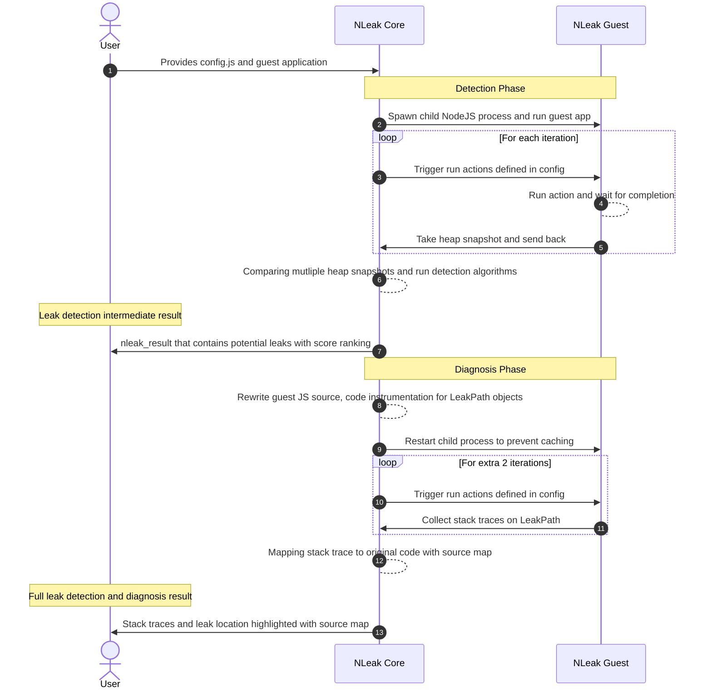

# Guest Folder Docs

## Core & Guest NodeJS process interaction overview


### Sequence Diagram



## Overview of project files.

<!-- ## Description

An in-depth paragraph about your project and overview of use.

## Getting Started -->

### config.ts
* Config sample leaking test
### wrapper.ts
*  Modify the require function to rewrite the guest app
### rewriting/closure_state_transform.ts
*  Given a JavaScript source file, modifies all function declarations and expressions to expose
 their closure state on the function object.
### rewriting/nleak_agent.ts
* Define nleak agent scope and create a scope object.

### rewriting/nleak_agent_transform.ts
* Override bind to properly capture `scope` here.
### rewriting/scopes.ts
*  Defines the given variable in the scope.
### rewriting/types.ts
* Variable type enum
### rewriting/utility.ts
* Define given type and expressions from `estree` library
### rewriting/visitors.ts
* Define given type and expressions from `estree` library
### test_apps/app_1.js
* Leaking object task case 1: add callable methods by other script aka wrapper.js, reference in BLeak repo
### test_apps/app_2.js
* Leaking object task case 2: add callable methods by other script aka wrapper.js

<!-- ### Installing

* How/where to download your program
* Any modifications needed to be made to files/folders

### Executing program

* How to run the program
* Step-by-step bullets
```
code blocks for commands
```

## Help

Any advise for common problems or issues.
```
command to run if program contains helper info
```

## Authors

Contributors names and contact info

ex. Dominique Pizzie  
ex. [@DomPizzie](https://twitter.com/dompizzie)

## Version History

* 0.2
    * Various bug fixes and optimizations
    * See [commit change]() or See [release history]()
* 0.1
    * Initial Release -->

